# Speech Enhancement using Deep Neural Networks

## Introduction

Whenever we work with real time speech signals, we need to keep in mind about various types of noises that gets added to the original noise and hence resulting in corruption of noise.
Therefore, in order to make a better sense of the signals, it is very much necessary to enhance the speech signals by removing the noises present in them.

## Applications:

- Automatic speech recognition
- Speaker recognition
- Mobile communication
- Hearing aids

## DNN based architectures

- Autoencoder Decoder
- Recurrent Neural Nets
- Restricted Boltzmann Machines

## Dataset:

The dataset used for this project is TCD-TIMIT speech corpus,a new Database and baseline for Noise-robust Audio-visual Speech Recognition

### Description

No of speakers: high-quality audio samples of 62 speakers
Total number of sentences: 6913 phonetically rich sentences
Each audio sample is sampled at 16,000 Hz
Three of the speakers are professionally-trained lipspeakers
6 types of Noises at range of SNR’s from -5db to 20 db
Babble, Cafe, Car, Living Room, White, Street

### Downloadable link for the dataset:

You can find the complete dataset here https://zenodo.org/record/260228

## Approach followed:

- Used log power spectrum of the signal as features
- Computed STFT of the signal with nfft=256, noverlap=128, nperseg=256
- STFT = log(abs(STFT))
- Trained the model with the Autoencoder decoder type network with input considering 16 frames  
  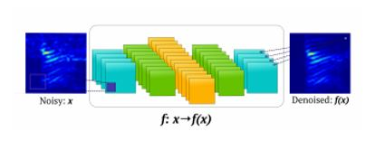
- Used Mean Square Error loss
- Adam optimizer (default parameters)

## Frameworks:

- Keras backend

## Network Overview

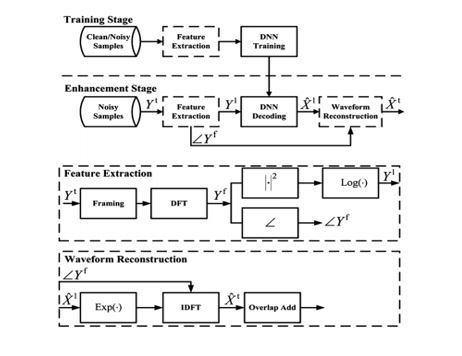

## Methods Implemented

1. Frame to frame training(Input will be noisy frame matrix, output will be clean matrix)
2. Considered the heuristic feature that the noise in the present frame depends both on the present frame and the past few frames.Based on this, trained a model considering past 7 frames and the present frame

### 1. Frame to frame:

- trained the network with noisy frame as the input and the corresponding clean frame as the output.

#### Architecture

#### Model

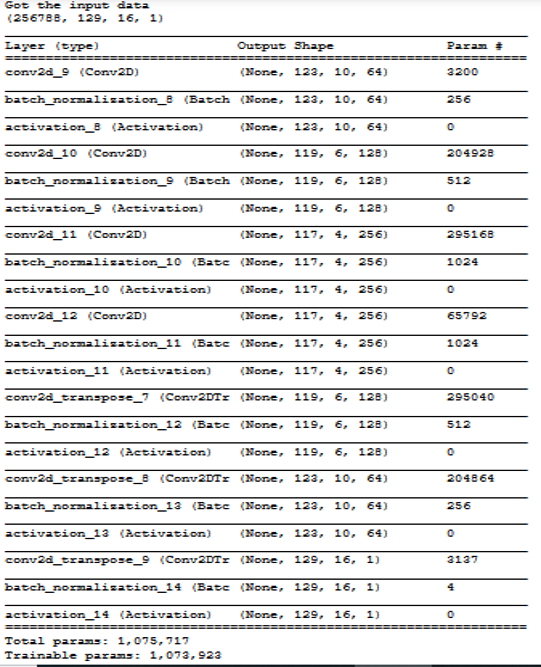

### Results

- The following waveforms are the results of the network when trained with above network

#### Clean Signal

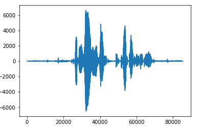

#### Corrupted Signal

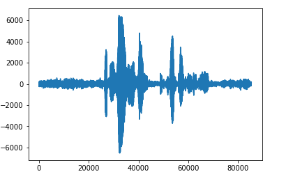

#### Enhanced Signal

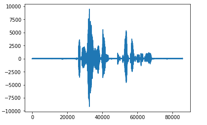

### 2. Network based on the past frames:

- trained the network with past 7 noisy frames concatinated with the present frame as the input and the corresponding present frame's clean frame as the output.

#### Architecture

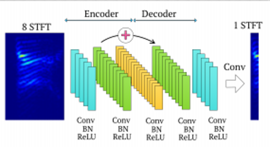

#### Model

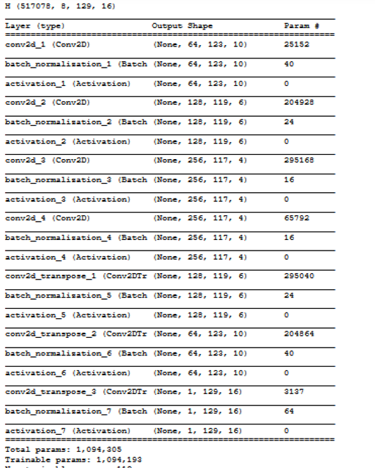

### Results

- The following waveforms are the results of the network when trained with above network

#### Clean Signal

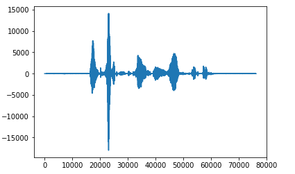

#### Corrupted Signal

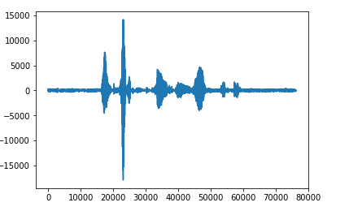

#### Enhanced Signal

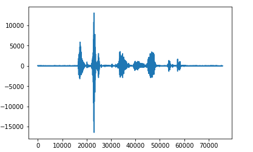

## Steps to reproduce:

## Data Preprocessing:

- First start with the `codes/cafe/final/globalcafe.ipynb` file (or `codes/babble/final/globalbabble-Copy1.ipynb`).
- Run the file by giving the correct folders where the dataset is stored. After running all the code blocks, you should have 2 files, the noisy pickle file and second, the cleanpickle file.
  - Tip ---> Try with the `cafe` file since it only consists of the code that has to be run.

## Training:

Assuming you continue with `cafe`, now that we have the data to train, run `codes/cafe/final/training_last8_50.ipynb` with the following changes.

- remove the GPU code if you do not have GPU's to train, (but having them is definitely an advantage)
- give the appropriate filenames for pickle_train (noisy pickle file) and pickle_trainlabel (clean pickle file)
- if you want to train with the last 8 frames:
  - you can continue to the next step
- if you want to train with only the current frame:
  - copy the first code block from `codes/babble/final/babblecnn-Copy1.ipynb`. You can also add `model.save('model_name.h5')` at the end to save the model along with the weights
- configure the `model.fit` params, i.e, `epochs`, `batch_size`, `validation_split`
- you can save either the model or the weights as you wish
- start the training

## Testing:

Once you're done with training, you can go ahead for testing. Code is present in the later part of `codes/cafe/final/training_last8_50.ipynb`

- first load the model with the model file you saved during training (or) load the weights and model.
- load a noisy wav file that you wish to test from the same noise category you trained
- preprocess the file in the same way you preprocessed the training data and do the prediction by calling `model.predict()`
- convert the reconstructed data into a `.wav` file and store it.
  - Note: Please look at the dimensions while reconstructing. If you're working with the past frames, you should be fine, but if you're working with the only current frame, you can copy the last code block in `codes/babble/final/babblecnn-Copy1.ipynb`.
- you can plot the data (noisy, clean, and reconstructed) using the code given at the end if you wish.

## References

- <i>Speech Enhancement In Multiple-Noise Conditions using Deep Neural Networks by Anurag Kumar, Dinei Florencio. Link: https://arxiv.org/pdf/1605.02427.pdf</i>
- <i>A FULLY CONVOLUTIONAL NEURAL NETWORK FOR SPEECH ENHANCEMENT by Se Rim Park and Jin Won Lee. Link: https://arxiv.org/pdf/1609.07132.pdf</i>
- <i>An Experimental Study on Speech Enhancement Based on Deep Neural Networks by Yong Xu, Jun Du, Li-Rong Dai, and Chin-Hui Lee. Link: https://www.researchgate.net/profile/Jun_Du11/publication/260493656_An_Experimental_Study_on_Speech_Enhancement_Based_on_Deep_Neural_Networks/links/588afb0eaca2727ec119d109/An-Experimental-Study-on-Speech-Enhancement-Based-on-Deep-Neural-Networks.pdf Alternate link: http://or.nsfc.gov.cn/bitstream/00001903-5/95174/1/1000006795890.pdf</i>
- <i>Experiments on Deep Learning for Speech Denoising by Ding Liu , Paris Smaragdis, Minje Kim. Link: https://paris.cs.illinois.edu/pubs/liu-interspeech2014.pdf</i>

## Note

- This project is made available for research purpose only.
- This project will be continued and updated through time.
- The codes are available for only babble and cafe noises. The codes for rest of the noises will be almost similar.

## Contact

For any further queries, contact: amballachaitanya777@gmail.com
