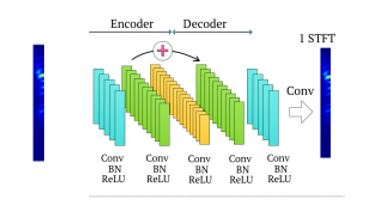

# Speech Enhancement using Deep Neural Networks
## Introduction
Whenever we work with real time speech signals, we need to keep in mind about various types of noises that gets added and hence resulting in corruption of noise.
Therefore, in order to make a better sense of the signals, it is very much necessary to enhance the speech signals by removing the noises present in them. 
## Applications:
* Automatic speech recognition
* Speaker recognition
* Mobile communication
* Hearing aids 

## DNN based architectures
* Autoencoder Decoder 
* Recurrent Neural Nets
* Restricted Boltzmann Machines

## Dataset:
The dataset used for this project is TCD-TIMIT speech corpus,a new Database and baseline for Noise-robust Audio-visual Speech Recognition

### Description
No of speakers: high-quality audio samples of 62 speakers
Total number of sentences: 6913 phonetically rich sentences
Each audio sample is sampled at 16,000 Hz
Three of the speakers are professionally-trained lipspeakers
6 types of Noises at range of SNR’s from -5db to 20 db
Babble, Cafe, Car, Living Room, White, Street

### Downloadable link for the dataset:
You can find the complete dataset here https://zenodo.org/record/260228

## Approach followed:
* Used log power spectrum of the signal as features
* Computed STFT of the signal with nfft=256, noverlap=128, nperseg=256
* STFT = log(abs(STFT))
* Trained the model with the Autoencoder decoder type network with input considering 16 frames 
 
* Used Mean Square Error loss
* Adam optimizer (default parameters)

## Frameworks:
* Keras backend

## Network Overview

## Methods Implemented

1. Frame to frame training(Input will be noisy frame matrix, output will be clean matrix)
2. Considered the heuristic feature that the noise in the present frame depends both on the present frame and the past few frames.Based on this, trained a model considering past 7 frames and the present frame

### 1. Frame to frame:
* trained the network with noisy frame as the input and the corresponding clean frame as the output.

#### Architecture

#### Model

### Results
* The following waveforms are the results of the network when trained with above network 

#### Clean Signal

#### Corrupted Signal

#### Enhanced Signal

### 2. Network based on the past frames:
* trained the network with past 7 noisy frames concatinated with the present frame as the input and the corresponding present frame's clean frame as the output.

#### Architecture

#### Model

### Results
* The following waveforms are the results of the network when trained with above network 

#### Clean Signal

#### Corrupted Signal

#### Enhanced Signal

## References
* <i>Speech Enhancement In Multiple-Noise Conditions using Deep Neural Networks by Anurag Kumar, Dinei Florencio. Link: https://arxiv.org/pdf/1605.02427.pdf</i>
* <i>A FULLY CONVOLUTIONAL NEURAL NETWORK FOR SPEECH ENHANCEMENT by Se Rim Park and Jin Won Lee. Link: https://arxiv.org/pdf/1609.07132.pdf</i>
* <i>An Experimental Study on Speech Enhancement Based on Deep Neural Networks by Yong Xu, Jun Du, Li-Rong Dai, and Chin-Hui Lee. Link: https://www.researchgate.net/profile/Jun_Du11/publication/260493656_An_Experimental_Study_on_Speech_Enhancement_Based_on_Deep_Neural_Networks/links/588afb0eaca2727ec119d109/An-Experimental-Study-on-Speech-Enhancement-Based-on-Deep-Neural-Networks.pdf Alternate link: http://or.nsfc.gov.cn/bitstream/00001903-5/95174/1/1000006795890.pdf</i>
* <i>Experiments on Deep Learning for Speech Denoising by Ding Liu , Paris Smaragdis, Minje Kim. Link: https://paris.cs.illinois.edu/pubs/liu-interspeech2014.pdf</i>
